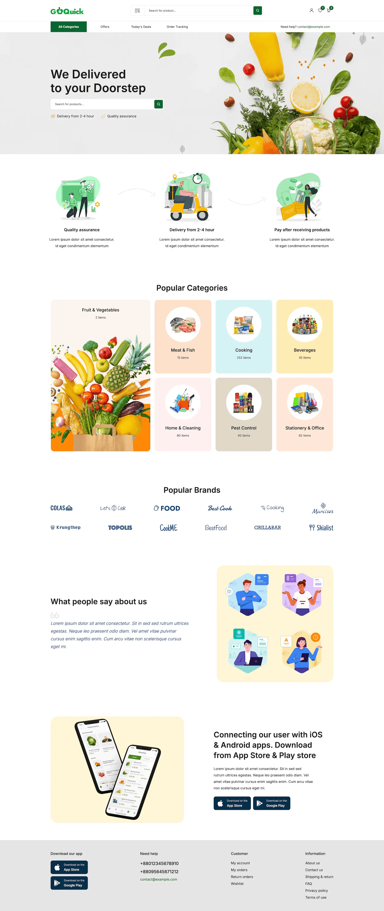

# go-quick-landing

---

## 📌 Overview

This project is a landing page to buy groceries online using **React**, **TypeScript**, with **Tailwind CSS**.

---

## 🛠 Getting Started

### ✅ Prerequisites

- Node.js `v18+`
- pnpm or npm

```bash
# Clone repo
git clone git@github.com:alexsantosquispe/go-quick-landing.git
cd go-quick-landing
```

```bash
# Install dependencies
npm install
```

```bash
# Run development server
npm run dev
```

Visit `http://localhost:5173` to view the app.

---

## 🖼️ Screenshots

<div style="display:flex; gap: 12px;">
  
</div>

---
